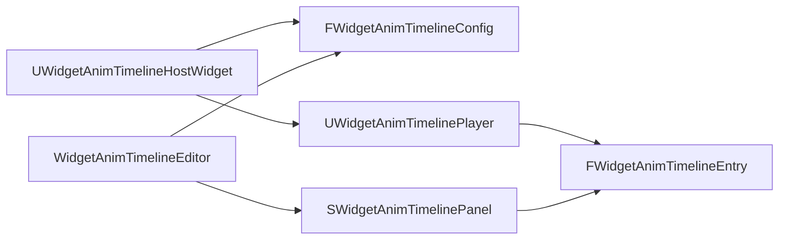

# Widget Anim Timeline Overview

> **TL;DR**
> - **目的:** 为 `UUserWidget` 提供本地的 Widget animation timeline 编排能力。
> - **适用范围:** `Plugins/WidgetAnimTimeline/` runtime module 与 editor module。
> - **核心设计:** runtime 只负责播放，editor 负责反射选项、timeline 可视化和 `StartTime` 编辑。
> - **关键入口:** `UWidgetAnimTimelineHostWidget`、`UWidgetAnimTimelinePlayer`、`SWidgetAnimTimelinePanel`。
> - **最后校验:** 2026-05-19

## 1. 概述 (Overview)

`WidgetAnimTimeline` 是一个独立 UE plugin，用于把一个 Widget 内部动画、子 Widget 动画序列按时间线统一编排。它不依赖 `UMGExt`，原因是当前工程的 module hierarchy 不允许 project plugin/module 反向引用另一个 plugin module；接入方式应通过 Widget 继承 `UWidgetAnimTimelineHostWidget` 或后续做公共基类上移。

插件分为两个 module：

| Module | 类型 | 职责 |
| --- | --- | --- |
| `WidgetAnimTimeline` | Runtime | 保存 timeline 配置，按 phase 播放 direct animation 或 child phase |
| `WidgetAnimTimelineEditor` | Editor | Details customization、reflection dropdown、timeline 编辑窗口 |

## 2. 架构 (Architecture)

`UWidgetAnimTimelineHostWidget` 持有 `AnimTimelineConfig` 和 transient 的 `AnimTimelinePlayer`。`NativeOnInitialized` 创建 player，`NativeConstruct` 根据 `AutoPlayPhaseName` 自动播放，`NativeDestruct` 停止未触发的 timer。

## 3. 数据结构 (Data Structures)

| 类型 | 关键字段 | 说明 |
| --- | --- | --- |
| `FWidgetAnimTimelineConfig` | `Phases`、`AutoPlayPhaseName` | Widget 级 timeline 配置 |
| `FWidgetAnimTimelinePhase` | `PhaseName`、`Entries` | 一段可播放 phase |
| `FWidgetAnimTimelineEntry` | `TargetWidgetName`、`EntryType`、`StartTime` | 单个时间线事件 |
| `EWidgetAnimTimelineEntryType` | `DirectAnimation`、`ChildSequencePhase` | 决定播放 Widget animation 还是触发 child phase |

源码里对这些运行时关键字段已有注释，重点位置在 `Plugins/WidgetAnimTimeline/Source/WidgetAnimTimeline/Public/WidgetAnimTimelineSequence.h`。

## 4. 核心流程 (Core Flows)

### 4.1 播放 phase

1. 调用 `UWidgetAnimTimelinePlayer::PlayPhase(PhaseName)`。
2. 通过 `FindPhase` 找到 `FWidgetAnimTimelinePhase`。
3. 先 `Stop()` 清理旧 timer。
4. 遍历 `Entries`，每个 entry 通过 `StartTime` 决定立即执行或注册 `FTimerHandle`。

### 4.2 播放 direct animation

`EntryType == DirectAnimation` 时，player 会根据 `TargetWidgetName` 找到目标 `UUserWidget`，再通过反射查找 `UWidgetAnimation` 属性。Blueprint 生成的 animation 属性通常带 `_INST` 后缀，运行时会移除后缀后匹配 `AnimationName`。

### 4.3 播放 child phase

`EntryType == ChildSequencePhase` 时，player 会把目标 widget cast 为 `UWidgetAnimTimelineHostWidget`，再调用目标 widget 自己的 `GetAnimTimelinePlayer()->PlayPhase(ChildPhaseName)`。这样可以支持“子蓝图的子蓝图动画”继续由各自 sequence 管理，而不是父级直接穿透控制深层动画。

## 5. Editor 行为 (Editor Behavior)

`WidgetAnimTimelineEditor` 注册两个 property customization：

| Customization | 功能 |
| --- | --- |
| `FWidgetAnimTimelinePhaseCustomization` | 在 phase 上提供 `Open Timeline` 按钮 |
| `FWidgetAnimTimelineEntryCustomization` | 把手写 `FName` 改为基于 reflection 的 dropdown |

Dropdown 规则：

- `TargetWidgetName` 显示 `Self (Owner)` 和 `WidgetTree` 中的 `UUserWidget` 子项。
- `AnimationName` 只在 `DirectAnimation` 下显示，选项来自目标 widget 的 `UWidgetAnimation` 属性。
- `ChildPhaseName` 只在 `ChildSequencePhase` 下显示，选项来自目标 `UWidgetAnimTimelineHostWidget` 的 `AnimTimelineConfig.Phases`。
- 当 `TargetWidgetName` 指向 self 时，`ChildPhaseName` 会过滤掉当前 phase，避免自递归。

## 6. Timeline 面板 (Timeline Panel)

`SWidgetAnimTimelinePanel` 提供类似 Sequencer 的轻量编辑面板：

- 相同 `TargetWidgetName` 的 entry 合并到同一 lane。
- 左键拖动 block 直接写回 `StartTime`。
- `MouseWheel` 缩放时间轴。
- 普通拖动按 `0.1s` snap，按住 `Shift` 使用 `0.01s` fine snap。
- 缩放后 ruler 会显示更密集的具体时间，例如 `0.5s`、`0.25s`、`0.10s`。

时间尺标签密度和拖拽写回逻辑在 `Plugins/WidgetAnimTimeline/Source/WidgetAnimTimelineEditor/Private/SWidgetAnimTimelinePanel.cpp` 有对应注释。

## 7. 接入指南 (Integration Guide)

1. 确认 `Neon.uproject` 启用了 `WidgetAnimTimeline`。
2. 让需要编排的 Widget Blueprint 继承 `UWidgetAnimTimelineHostWidget`。
3. 在 Details 中配置 `AnimTimelineConfig.Phases`。
4. 对每个 entry 选择 `TargetWidgetName`、`EntryType` 和 animation 或 child phase。
5. 使用 `Open Timeline` 打开 timeline 面板，通过拖动 block 调整 `StartTime`。
6. 如果需要自动播放，在 `AutoPlayPhaseName` 填入 phase name。

## 8. 边界 (Boundaries)

- 当前版本不直接修改 `UMGExtUserWidget`，避免 module hierarchy 问题。
- 当前 timeline block duration 是 editor 预览宽度，不代表 animation asset 的真实时长。
- 当前是本地 Widget 播放编排，不处理网络同步。

## 9. 相关文档 (Related Documents)

- `Plugins/WidgetAnimTimeline/DevDocs/Backlog/widget-anim-timeline-backlog.md`
